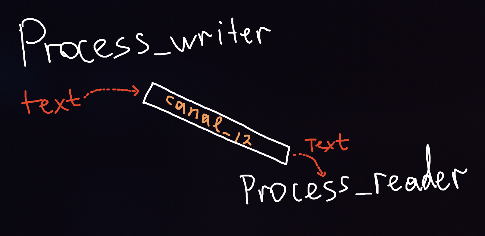

# ИДЗ 1 Лазарев Василий Вариант 26

## Условие задачи
```
Разработать программу, которая определяет количество целых
чисел в ASCII-строке. числа состоят из цифр от 0 до 9. 
Разделителями являются все другие символы.
```
Планируемая оценка: ~8

## Решение:
### Критерии на оценку 4:
```
- Для задания имен входного и выходного файлов используются 
аргументы командной строки.
- Ввод и вывод данных при работе с файлами осуществляется через
системные вызовы read и write. (79, 86, 110, 128 и тд... строки кода)
- Представлен набор (не менее пяти) текстовых файлов, на которых
проводилось тестирование программы и для каждого из тестовых файлов представлен файл, полученный
в результате работы программы. Папка 'tests' в cmake-build-debug.
```

#### Компиляция и запуск программы:
```asm
gcc main.c
./a.out {input file name} {output file name}
```
#### Визуализация взаимодействия двух процессов через канал:

#### Описание работы:
• Первый процесс читает текстовые данные из {input file name} файла и через неименованный канал 1 передает их своему ребенку, то есть
второму процессу;

• Второй процесс считает количество чисел в данных полученных из канала 1 и передаёт результат обработки через 
неименованный канал 2 своему ребенку, то есть третьему процессу;

• Третий процесс получает результат работы второго процесса из второго канала и записывает их в файл.

### Критерии на оценку 5:
```
Теперь используются именованные каналы
```
Компиляция и запуск происходят аналогично предыдущему пункту.
#### Описание работы с именованными каналами

• Первый процесс читает данные из входного файла и передает их по каналу pipe1.fifo 
второму процессу, который является его ребенком;

• Второй процесс считает количество чисел в данных, полученных из pipe1.fifo, затем передает эту информацию
третьему процессу, который является его ребенком;

• Третий процесс выводит количество в указанный файл вывода.

### Критерии на оценку 6:
```
Запуск аналогичен способу описаному в критериях на оценку 4.
```
#### Описание работы
• Первый процесс читает текстовые данные из заданного файла
и через неименованный канал передает их второму процессу;

• Второй процесс осуществляет обработку данных в соответствии
с заданием и передает результат обработки через неименованный канал обратно первому процессу;

• Первый процесс осуществляет вывод данных в заданный файл.
### Критерии на оценку 7:
```
Запуск аналогичен способу описаному в критериях на оценку 4.
```
#### Описание работы
• Первый процесс читает текстовые данные из заданного файла
и через именованный канал передает их второму процессу;

• Второй процесс осуществляет обработку данных в соответствии
с заданием и передает результат обработки через именованный
канал обратно первому процессу;

• Первый процесс осуществляет вывод данных в заданный файл.

#### Давно не было картинок...


### Критерии на оценку 8:
Необходимо перейти в rating_8, внутри лежат rating_8_first.c и rating_8_second.c

##### Запуск и компиляция:
```asm
gcc rating_8_first.exe rating_8_first.c
gcc rating_8_second.exe rating_8_second.c
./rating_8_first.exe input.txt output.txt
./rating_8_second.exe
```
#### Описание работы
• Первый процесс читает текстовые данные из заданного файла
и через именованный канал передает их второму процессу;

• Второй процесс осуществляет обработку данных в соответствии
с заданием и передает результат обработки через именованный
канал обратно первому процессу;

• Первый процесс осуществляет вывод данных в заданный файл.

На экран выводится информация об ошибках, какой процесс кого ждет и т.д.
Все тесты находятся в папке tests. В main.c остался код на оценку 4, по дефолту он берет файлы из cmake-build-debug.
Если требуется другое место, пропишите это в ручную.